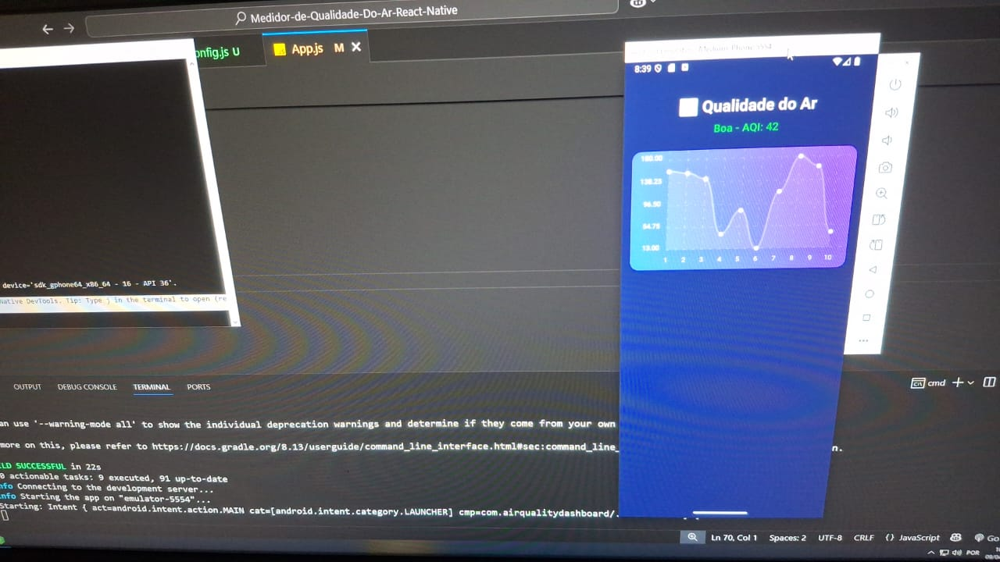

# Medidor de Qualidade do Ar - React Native

Este é um aplicativo mobile feito em **React Native** que mostra na tela a leitura da qualidade do ar e apresenta os dados visualmente com gráficos dinâmicos capturados com sensores físicos como o **MICS-5524** via **Raspberry Pi Pico W**.

Este projeto faz parte do da atividade extracurricular do curso de Programação para dispositivos móveis da Faculdade Martha Falcão.

---

## Funcionalidades

- Exibição do **Índice de Qualidade do Ar (AQI)** em tempo real
- Gráfico que mostra a variação do AQI ao longo do tempo
- Indicador visual de **bom** ou **ruim**
- Interface moderna e responsiva

---

## Tecnologias

- [React Native](https://reactnative.dev/)
- [react-native-chart-kit](https://github.com/indiespirit/react-native-chart-kit)
- [react-native-svg](https://github.com/software-mansion/react-native-svg)
- [react-native-vector-icons](https://github.com/oblador/react-native-vector-icons)

---

## Como rodar localmente

### 1. Clone o projeto

```bash
git clone https://github.com/IcaroRP/Medidor-de-Qualidade-Do-Ar-React-Native
cd Medidor-de-Qualidade-Do-Ar-React-Native
```

### 2. Instale as dependências

```bash
npm install
```

### 3. Instale pacotes extras

```bash
npm install react-native-chart-kit react-native-svg
```

> Se for usar ícones:
```bash
npm install react-native-vector-icons
```

### 4. Rode no Android

> Certifique-se de que um **emulador Android** está rodando ou um **dispositivo físico** está conectado via USB.

```bash
npx react-native run-android
```

---

## Futuras funcionalidades

- Leitura real do sensor MICS-5524 via Raspberry Pi - (Atualmente mostra dados falsos como preview)
- Comunicação com o app por Wi-Fi (REST API)
- Alertas e notificações em tempo real

---

## Requisitos

- Node.js instalado
- Android Studio com SDK 33 ou superior
- Emulador Android criado e funcional
- Java 17+

---

## Preview

> Interface atual do app:



---

## Autor

**Icaro Ribeiro**  
[LinkedIn](https://www.linkedin.com/in/icarorp/) • [GitHub](https://github.com/IcaroRP/)

